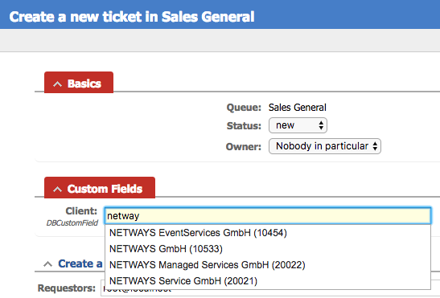
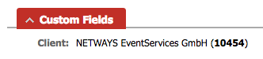

# DBCustomField Extension for Request Tracker

#### Table of Contents

1. [About](#about)
2. [License](#license)
3. [Support](#support)
4. [Requirements](#requirements)
5. [Installation](#installation)
6. [Configuration](#configuration)


## About

Connect databases to custom fields.

- Search for multiple values with custom queries.
- Livesearch on custom field creation.
- Map search and query results into presentation templates.
- Custom field stores a single global ID, future ticket views always fetch the external current data.






## License

This project is licensed under the terms of the GNU General Public License Version 2.

This software is Copyright (c) 2018 by NETWAYS GmbH <[support@netways.de](mailto:support@netways.de)>.

## Support

For bugs and feature requests please head over to our [issue tracker](https://github.com/NETWAYS/rt-extension-dbcustomfield/issues).
You may also send us an email to [support@netways.de](mailto:support@netways.de) for general questions or to get technical support.

## Requirements

- RT 4.4.2

## Installation

Extract this extension to a temporary location

Git clone:

```
cd /usr/local/src
git clone https://github.com/NETWAYS/rt-extension-dbcustomfield
```

Tarball download (latest [release](https://github.com/NETWAYS/rt-extension-dbcustomfield/releases/latest)):

```
cd /usr/local/src
wget https://github.com/NETWAYS/rt-extension-dbcustomfield/archive/v1.1.0.zip
unzip v1.1.0.zip
```

Navigate into the source directory and install the extension.

```
perl Makefile.PL
make
make install
```

Clear your mason cache.

```
rm -rf /opt/rt4/var/mason_data/obj
```

Restart your web server.

```
systemctl restart httpd

systemctl restart apache2
```


## Configuration

Edit your `/opt/rt4/etc/RT_SiteConfig.pm` configuration and include the extension.

```
Plugin('RT::Extension::DBCustomField');
```

### Connections

Specify the connection identifier and its settings.

```
Set($DBCustomField_Connections, {
        'sugarcrm' => {
                'dsn'                   => 'DBI:mysql:database=sugarcrm;host=mysql-server.localdomain;port=3306;mysql_enable_utf8=1',
                'username'              => 'username',
                'password'              => 'password',
                'autoconnect'           => 1
        },
});
```

### Queries

Specify the query and its settings. This is where the logic hides for

- Add/Edit the CF value
- Show the CF value in ticket views

Both views require their own queries, selected return field mappings,
where conditions and the global unique ID which is stored as CF value.

You can also control the formatted values as templates for

- livesearch dropdown
- form input
- shown as CF

More details are explained in the example below which queries company details
from sugarCRM.

```
Set ($DBCustomField_Queries, {
        'companies' => {
                # Specify the connection to use defined in $DBCustomField_Connections.
                'connection' => 'sugarcrm',

                ##########################################################
                # Edit CF

                # Specify the search query.
                #
                # '?' binds the user's search input into the query as WHERE condition.
                'suggestions' => q{
                    SELECT
                    cstm.net_global_id_c AS field_value, cstm.shortname_c AS shortname, a.name
                    FROM accounts a
                    INNER JOIN accounts_cstm cstm ON cstm.id_c = a.id AND cstm.net_global_id_c
                    WHERE a.deleted = 0 AND (cstm.net_global_id_c = ? OR cstm.shortname_c LIKE ? OR a.name LIKE ?)
                    ORDER BY shortname
                },

                # Specify the template returned by the search. This is rendered via JS dropdown.
                'suggestions_tpl' => q{
                    <div>
                        <strong>{shortname}</strong>
                        <div>{name} (<strong>{field_value}</strong>)</div>
                    </div>
                },

                ##########################################################
                # View DBCF

                # Specify the view query.
                #
                # '?' binds the value of the 'field_value' column into the query as WHERE condition.
                'display_value' => q{
                    SELECT
                    cstm.net_global_id_c AS field_value, cstm.shortname_c AS shortname
                    FROM accounts a
                    INNER JOIN accounts_cstm cstm ON cstm.id_c = a.id AND cstm.net_global_id_c
                    WHERE cstm.net_global_id_c = ?
                },

                # Specify the template used to show this CF inside the ticket details.
                'display_value_tpl' => '{shortname} ({field_value})'
        },

});
```

### Create Custom Fields

Create a new custom field and choose the following type:

- Select one value with autocompletion from db source

### Custom Fields Map

Map the defined queries to custom field names.

The following example maps the CF `Client` to the `companies` query configured above.

```
Set($DBCustomField_Fields, {
        'Client'            => 'companies',
});

```
